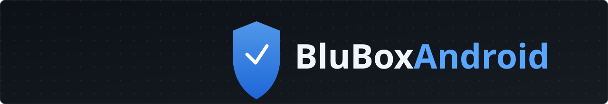

  

### Hi there, I'm BoxNest 👋

Android developer & self-hoster. I build useful tools with clean, reproducible builds — currently working on proxy clients powered by the **sing-box** core.

### 🧰 Tech Stack

  

  
  
  
  
  
  

---

### 📊 Top Languages

  
  

### 📈 Activity

  

BluBoxAndroid

### 🚀 Projects

| Project | What it is |
|---|---|
| **[BluBox](https://github.com/BoxNest/BluBox)** | Custom Android proxy client based on NekoBox, powered by the sing-box core. Clean UI, zero bundled nodes, GPLv3. |

### 🧰 Self-hosted lab

A small fleet of Debian VPS running Docker, sing-box nodes (Hysteria2 + ECH, VLESS + Reality), health monitoring and daily hygiene — all scripted, all reproducible.

---

  BoxNest · build something useful

